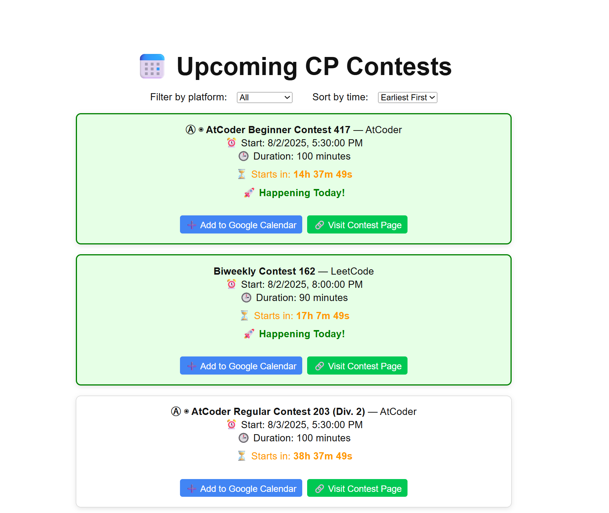

# 🗓️ CP Contest Aggregator

A full-stack web app that aggregates upcoming competitive programming contests from major platforms and displays them in a user-friendly calendar view, with options to add contests directly to Google Calendar.

---

## 🚀 Features

- 🔁 Fetches contests from **Codeforces, AtCoder, LeetCode, and CodeChef**
- ⏰ Auto-updates every 12 hour using **Celery + Celery Beat**
- 🧠 Backend built with **Django + Django REST Framework**
- ⚛️ Frontend powered by **React**
- 🗓️ One-click **Google Calendar integration**

---

## 🛠️ Tech Stack

| Layer      | Tech                                                                 |
|------------|----------------------------------------------------------------------|
| Frontend   | React                                                                |
| Backend    | Django, Django REST Framework                                        |
| Scraping   | BeautifulSoup, Requests                                              |
| Async Jobs | Celery, Celery Beat, Redis                                           |

---

## 📦 Installation

### Backend

```bash
git clone https://github.com/Aayushs1602/cp-contest-aggregator.git
cd cp-contest-aggregator/backend
pip install -r requirements.txt
python manage.py migrate
python manage.py runserver
```

### Frontend

```bash
cd ../frontend
npm install
npm start
```


## 🔄 Background Task Setup

* **Celery Worker**: Runs background scraping jobs.
* **Celery Beat**: Triggers scheduled tasks every hour.
* **Redis**: Acts as the broker for Celery (local or Upstash).

To run them locally:

```bash
# Start Redis locally
redis-server

# Run Celery worker
celery -A cp_aggregator worker --loglevel=info

# Run Celery beat
celery -A cp_aggregator beat --loglevel=info
```

---

## 📅 UI Highlights

* Contest cards with platform logos, timers, link to contest page and calendar integration
* Filtering options based on platform name and timing
* Highlights the contest taking place today


---

## 📈 Metrics

* Aggregates contests from **4 platforms**
* Refreshes contest data **every 12 hour**
* Adds contests to **Google Calendar** with a single click

---

## 🧑‍💻 Author

**Aayush Srivastava**
[GitHub](https://github.com/Aayushs1602) • [LinkedIn](https://www.linkedin.com/in/aayushs1602)


